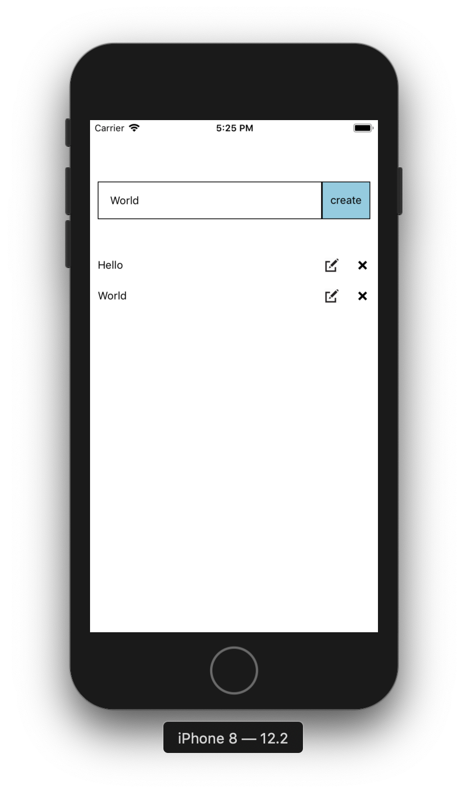
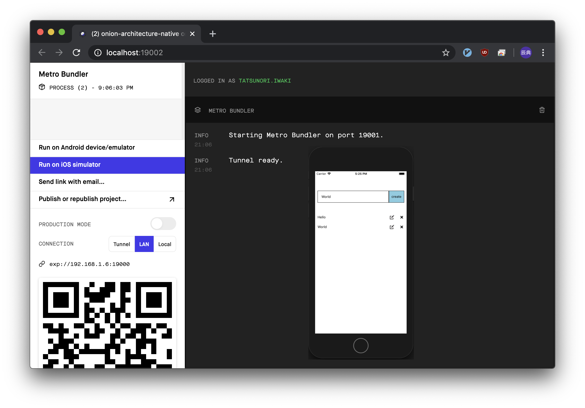

<h1 align="center">
  <br>
  
  <br>
  iwaki-onion-architecture-for-vuejs
  <br>
</h1>
<h4 align="center">
  Vuejs web example implemented based on onion architecture.
  <br>This is a very simple TODO application using TypeScript.
  <br>Implements API calls by axios up to mock. with in-memory nedb.
  <br>
  <br>
  <br>
</h4>

<!-- ---------------------------------------- -->
# Screenshot - webapp case
Enriching implementations by allowing program boundaries by architecture.

Vue, located in the presentation layer, can focus solely on the duties of expressing.


# Screenshot - electron case
electron is very simple. Almost all creation is completed just by adding the electron-builder module

Most of the content implemented with "onion architecture" is the same. The only difference is whether the app has become a webapp or a desktop app.


# Screenshot - native case
Native apps have some difficulties, but everything can be programmed with javascript. This is amazing.

Vue version of react native with expo. Base built using vue-native. Further expansion to "TypeScript".



# Presentation


# Traditional layered architecture


# Dependency reversal principle


# HelloRepository became Interface


# Onion architecture


# Class diagram


# How to use
## 🍺 clone projects
```
cd ~/IdeaProjects
git clone https://github.com/tatsunori-iwaki/iwaki-onion-architecture-for-vuejs.git
```

## 🍺 web application case
```
cd ~/IdeaProjects/iwaki-onion-architecture-for-vuejs/onion-architecture-webapp
yarn
yarn test:unit
yarn serve
```

## 🍺 electron develop application case
```
cd ~/IdeaProjects/iwaki-onion-architecture-for-vuejs/onion-architecture-electron
yarn
yarn electron:serve
```

## 🍺 electron package application case
```
cd ~/IdeaProjects/iwaki-onion-architecture-for-vuejs/onion-architecture-electron
yarn
yarn electron:build
ls -l ./dist_electron/mac/
open ./dist_electron/mac/onion-architecture-electron.app
```

## 🍺 native package application case
```
cd ~/IdeaProjects/iwaki-onion-architecture-for-vuejs/onion-architecture-native
yarn
yarn start
```


# Initial build documentation
[README-PROCEDURE-VUE.md](./README-PROCEDURE-VUE.md)

[README-PROCEDURE-ELECTRON.md](./README-PROCEDURE-ELECTRON.md)

[README-PROCEDURE-NATIVE.md](./README-PROCEDURE-NATIVE.md)

# how to e2e
[README-E2E-NIGHTWATCH-VUE.md](./README-E2E-NIGHTWATCH-VUE.md)

