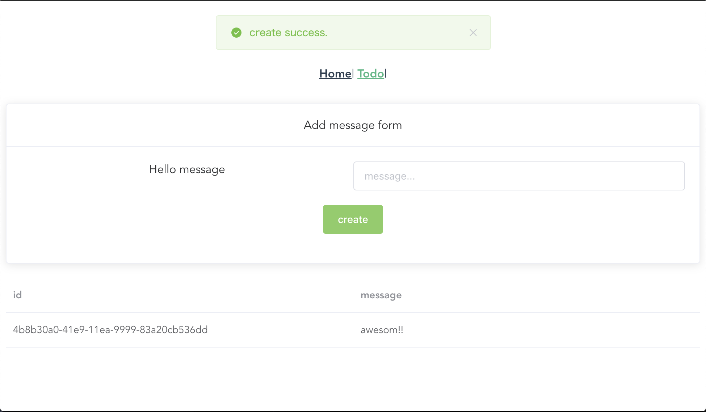
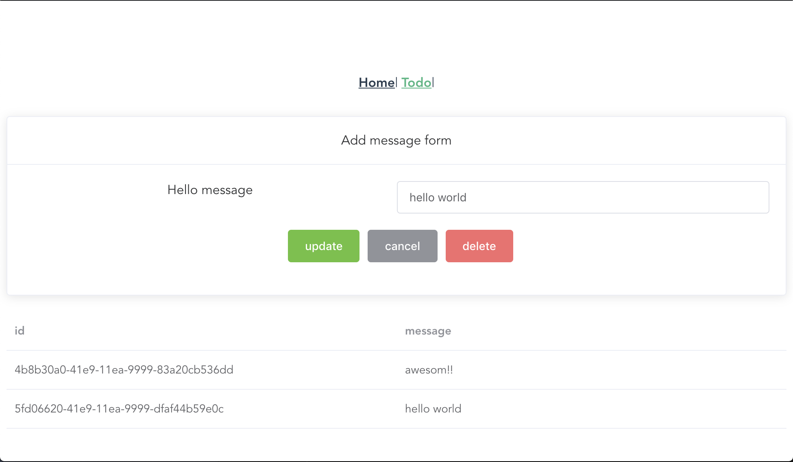
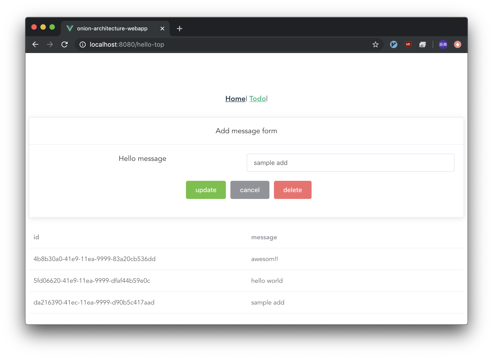
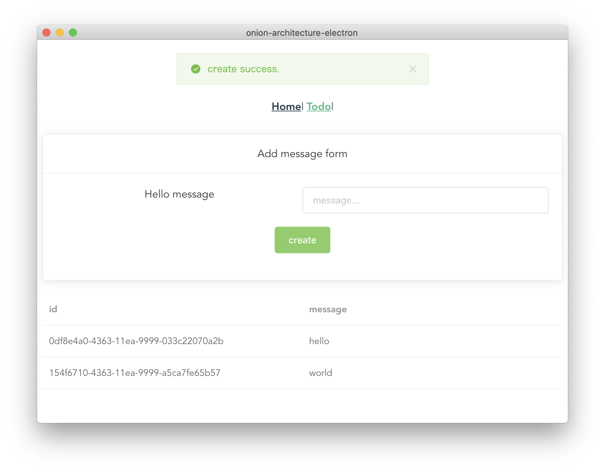
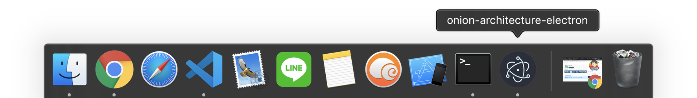
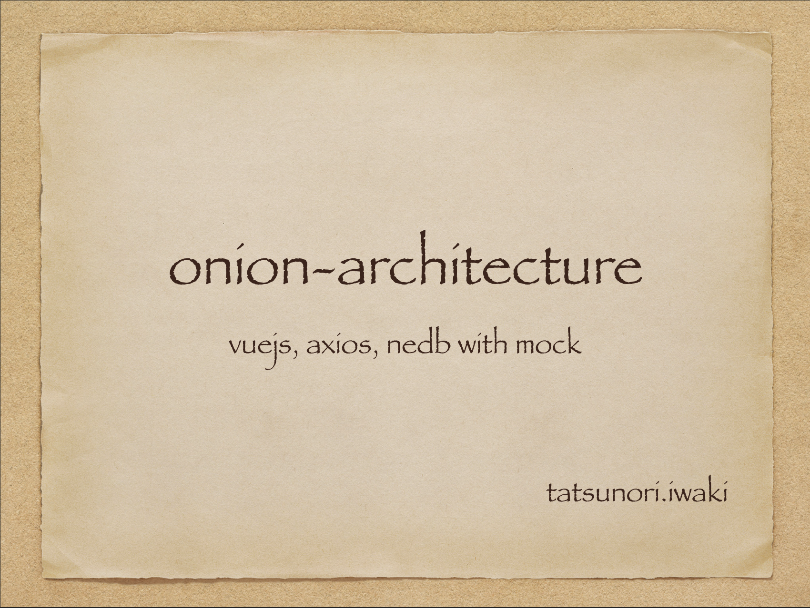
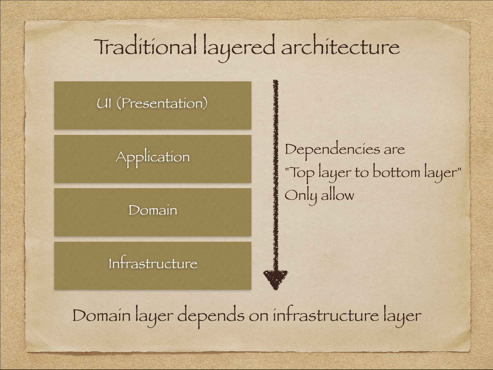
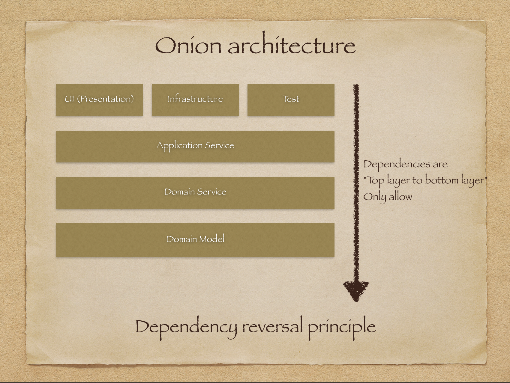
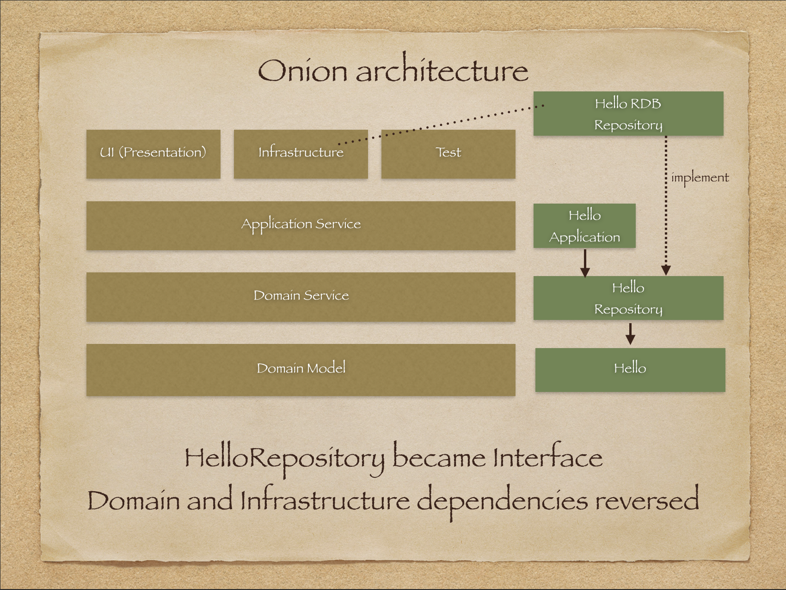

<h1 align="center">
  <br>
  
  <br>
  iwaki-onion-architecture-for-vuejs
  <br>
</h1>
<h4 align="center">
  Vuejs web example implemented based on onion architecture.
  <br>This is a very simple TODO application using TypeScript.
  <br>Implements API calls by axios up to mock. with in-memory nedb.
</h4>

# Screenshot - webapp case




# Screenshot - electron case



# Presentation


# Traditional layered architecture


# Dependency reversal principle


# HelloRepository became Interface


# Onion architecture


# Class diagram


# How to use
## 🍺 clone projects
```
cd ~/IdeaProjects
git clone https://github.com/tatsunori-iwaki/iwaki-onion-architecture-for-vuejs.git
```

## 🍺 web application case
```
cd ~/IdeaProjects/iwaki-onion-architecture-for-vuejs/onion-architecture-webapp
yarn
yarn test:unit
yarn serve
```

## 🍺 electron develop application case
```
cd ~/IdeaProjects/iwaki-onion-architecture-for-vuejs/onion-architecture-electron
yarn
yarn electron:serve
```

## 🍺 electron package application case
```
cd ~/IdeaProjects/iwaki-onion-architecture-for-vuejs/onion-architecture-electron
yarn
yarn electron:build
ls -l ./dist_electron/mac/
open ./dist_electron/mac/onion-architecture-electron.app
```

# Initial build documentation
[README-PROCEDURE-VUE.md](./README-PROCEDURE-VUE.md)
[README-PROCEDURE-VUE.md](./README-PROCEDURE-ELECTRON.md)

